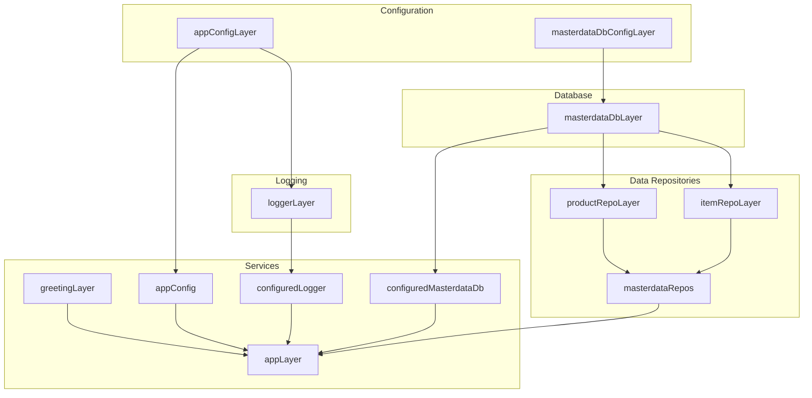

import { Aside } from '@astrojs/starlight/components';

**@lect-effect/backend** is the runnable GraphQL server. It selects the handler catalog, builds a typed schema with gqloom, injects the Effect runtime into Yoga, and wires live infrastructure (config, logging, Postgres repos) via layers.




## What it provides

- **Application wiring** that loads config, selects handlers, turns them into gqloom resolvers, builds the schema, and starts Yoga HTTP server ([apps/backend/src/app.ts](apps/backend/src/app.ts)).
- **Runtime entrypoint** that memoizes the full service layer, runs the app, and pretty-logs failures ([apps/backend/src/index.ts](apps/backend/src/index.ts)).
- **GraphQL glue**: handler→resolver adapters, schema weaving/sorted printing, Yoga server with Effect runtime in context, and HTTP server lifecycle helpers ([apps/backend/src/graphql](apps/backend/src/graphql)).
- **Live infrastructure layers** for config, logging, master data Postgres, and item/product repositories ([apps/backend/src/services/app/layer.ts](apps/backend/src/services/app/layer.ts)).
- **NPM scripts**: `build`, `start` (build then run with `.env`), `test` (typecheck then Vitest with `.env.test`), and `typecheck:test` (see [apps/backend/package.json](apps/backend/package.json)).

## Dependency boundaries

- **Depends on**: `effect`, `@effect/sql` + `@effect/sql-pg`, `@gqloom/core` + `@gqloom/effect`, `graphql`, `graphql-yoga`, and internal packages `@lect-effect/domain`, `@lect-effect/handlers`, `@lect-effect/services`.
- **Provides**: the live server plus resolvers/schema generation consumed by `@lect-effect/graphql-schema` (SDL emission) and by clients hitting the GraphQL endpoint.
- **Never owns domain logic**: business rules stay in handlers/services; backend only wires runtime, transport, and infra.

## Key modules

- **App orchestration**: [apps/backend/src/app.ts](apps/backend/src/app.ts) loads `AppConfig`, selects handler sets (hello/item/product), converts them to resolvers, builds the schema, and starts Yoga on the configured port.
- **Main entry**: [apps/backend/src/index.ts](apps/backend/src/index.ts) memoizes `appLayer`, runs `app`, and logs rich failure causes.
- **GraphQL plumbing**:
  - Context/runtime typing ([apps/backend/src/graphql/context.ts](apps/backend/src/graphql/context.ts)).
  - `runEffect` bridge for resolvers ([apps/backend/src/graphql/effect.ts](apps/backend/src/graphql/effect.ts)).
  - Error types (`ServerStartError`, `RuntimeMissingFromContextError`) ([apps/backend/src/graphql/errors.ts](apps/backend/src/graphql/errors.ts)).
  - Handler→resolver adapters using Effect schemas ([apps/backend/src/graphql/resolvers.ts](apps/backend/src/graphql/resolvers.ts)).
  - Schema weaving and sorted printing ([apps/backend/src/graphql/schema.ts](apps/backend/src/graphql/schema.ts)).
  - HTTP/Yoga lifecycle ([apps/backend/src/graphql/server.ts](apps/backend/src/graphql/server.ts), [apps/backend/src/graphql/yoga.ts](apps/backend/src/graphql/yoga.ts)).
- **Service layers** (all under [apps/backend/src/services](apps/backend/src/services)):
  - Config loaders for app and PG env vars (`BACKEND_PORT`, `BACKEND_ENV`, `BACKEND_LOG_LEVEL`, `MASTERDATA_PG_*`) via Effect Config ([services/config/layer.ts](apps/backend/src/services/config/layer.ts)) and a lighter app-only variant ([services/appConfig/implementation.ts](apps/backend/src/services/appConfig/implementation.ts)).
  - Logging minimum level from config ([services/logger/layer.ts](apps/backend/src/services/logger/layer.ts)).
  - Masterdata PG client via `@effect/sql-pg` and injected config ([services/masterdataDb/layer.ts](apps/backend/src/services/masterdataDb/layer.ts)).
  - Greeting service ([services/greeting](apps/backend/src/services/greeting/implementation.ts)).
  - Item and product repos backed by PG with schema-backed decoding and debug logging ([services/itemRepo/implementation.ts](apps/backend/src/services/itemRepo/implementation.ts), [services/productRepo/implementation.ts](apps/backend/src/services/productRepo/implementation.ts)).
  - Aggregated `appLayer` composing config, logger, DB, repos, and greeting into `AppServices` ([services/app/layer.ts](apps/backend/src/services/app/layer.ts)).

## Usage patterns

### Run the server locally

Ensure env vars exist (or populate `.env`), then:

```bash
pnpm --filter @lect-effect/backend run start
```

This builds the package, loads config (`BACKEND_PORT` defaults to 4000), and starts Yoga at `http://localhost:<port>/graphql`.

### Extend the GraphQL surface

Add or change handlers in `@lect-effect/handlers`, include them in `selectHandlers` in [apps/backend/src/app.ts](apps/backend/src/app.ts), and regenerate SDL via `@lect-effect/graphql-schema` to keep frontend codegen in sync.

### Wire new infrastructure

Provide new live services as Effect layers under [apps/backend/src/services](apps/backend/src/services) and merge them into `appLayer`. Resolvers automatically gain access through the Effect runtime placed in Yoga context.

## Principles reinforced here

- **Typed transport**: gqloom resolvers are derived from handler schemas, keeping GraphQL types aligned with domain definitions.
- **Explicit wiring**: all runtime requirements flow through layers (`appLayer`) rather than hidden globals.
- **Deterministic schema**: schema weaving + sorted printing keeps SDL stable for reviews and codegen.
- **Directional deps**: backend depends on domain/handlers/services; consumers depend on the exposed GraphQL endpoint and emitted SDL.

<Aside type="tip" icon="star" title="Next steps">
Run `pnpm --filter @lect-effect/backend run test` to typecheck tests, or regenerate SDL with `pnpm --filter @lect-effect/graphql-schema run schema:generate` after handler or schema changes.
</Aside>
