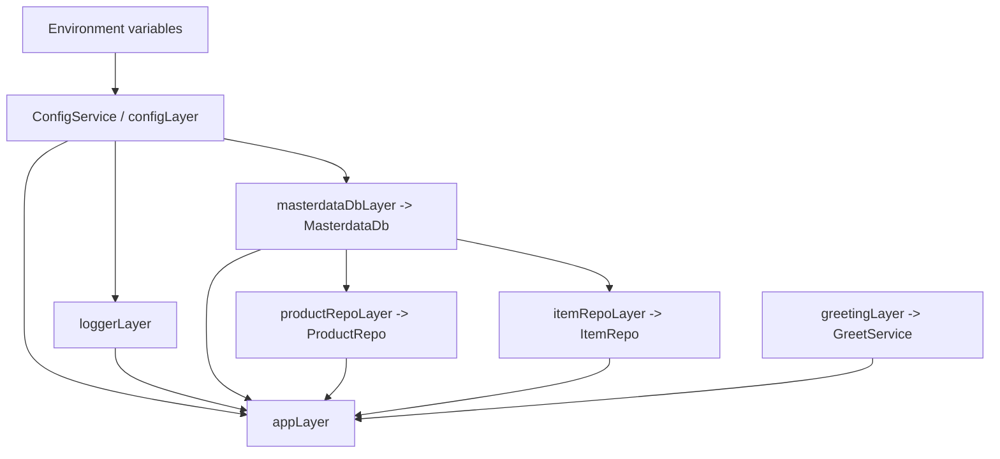

lect-effect’s runtime has two complementary shapes:

1. A **service environment** `AppServices` built by `appLayer`.
2. A **GraphQL server** whose resolvers are executed by an `Effect` runtime injected into request context.

If you want a categorical slogan:

> `Layer` constructs the environment object `R`, and `Effect<A, E, R>` is a morphism in the Kleisli category parameterized by `R`.

---

## The dependency graph (services and layers)

The main environment is:

- `AppServices = ConfigService | GreetService | MasterdataDb | ProductRepo | ItemRepo`

Layer composition (conceptual):

- `configLayer : Layer<ConfigService>`
- `loggerLayer : Layer<Logger, ConfigService>`
- `masterdataDbLayer : Layer<MasterdataDb, ConfigService>`
- `productRepoLayer : Layer<ProductRepo, MasterdataDb>`
- `itemRepoLayer : Layer<ItemRepo, MasterdataDb>`
- `greetingLayer : Layer<GreetService>`
- `appLayer : Layer<AppServices, AppError>`

A useful diagram:

---

## Startup pipeline (process-level)

The entrypoint does (schematically):

1. Load `.env` via `dotenv/config`
2. Build a top-level Effect `main`
3. Provide `appLayer`
4. Run with `NodeRuntime.runMain(main)`

During `app` startup:

* build a GraphQL schema via `makeSchema()`
* create Yoga via `makeYoga(schema)`
* start an HTTP server (Node `http.createServer`) that delegates to Yoga

---

## Request pipeline (HTTP → GraphQL → Effect)

When an HTTP request comes in:

1. **GraphQL Yoga** parses and executes the GraphQL operation.
2. Yoga’s `context` function enriches the request context with:

   * an `Effect` runtime for `AppServices`.

Then, inside a resolver:

3. The resolver calls `runEffect(handlerEffect)`.

`runEffect` is explicitly a **natural transformation**:

* from the functor “Effect computations requiring `AppServices`”
* to the functor “Promises” (JS async boundary)

In code terms:

* `Effect<A, E, AppServices> -> Promise<A>`
* implemented by `Runtime.runPromise(runtime, eff)` using the runtime stored in GraphQL context.

---

## Domain-to-GraphQL schema construction

Schema construction happens via GQLoom:

* resolvers are assembled (queries, mutations, field resolvers)
* `weave(EffectWeaver, asyncContextProvider, ...resolvers)` produces a `GraphQLSchema`

This is the critical “don’t repeat yourself” junction:

* The same **Effect Schema** definitions drive:

  * runtime validation,
  * TypeScript types,
  * and GraphQL type construction (via `@gqloom/effect`).

---

## Persistence and decoding

Repositories use:

* `@effect/sql` + `@effect/sql-pg` for SQL client access.
* DB rows (unknown data) are decoded into domain structures using Effect Schema decoders.

This gives you a tight triangle:

1. SQL returns unknown rows
2. `Schema.decodeUnknown` parses them
3. you re-enter the domain category with validated objects

---

## Testing architecture

Tests mirror the runtime split:

* **Domain tests**: schema properties (often property-based via fast-check).
* **Handler tests**: semantics in the Kleisli world.
* **GraphQL tests**: Yoga executed with a `testAppLayer` providing:

  * test config
  * test logger
  * test DB client
  * repos

The important invariant: the *same resolver code* runs, but with a different layer graph.

---

## Reference links

* Effect services + requirements: [https://effect.website/docs/requirements-management/services/](https://effect.website/docs/requirements-management/services/)
* Effect Layers: [https://effect.website/docs/requirements-management/layers/](https://effect.website/docs/requirements-management/layers/)
* Effect Schema: [https://effect.website/docs/schema/introduction/](https://effect.website/docs/schema/introduction/)
* GQLoom weave: [https://gqloom.dev/docs/weave.html](https://gqloom.dev/docs/weave.html)
* GQLoom Effect Schema integration: [https://gqloom.dev/docs/schema/effect.html](https://gqloom.dev/docs/schema/effect.html)
* GraphQL Yoga: [https://the-guild.dev/graphql/yoga-server/docs](https://the-guild.dev/graphql/yoga-server/docs)
